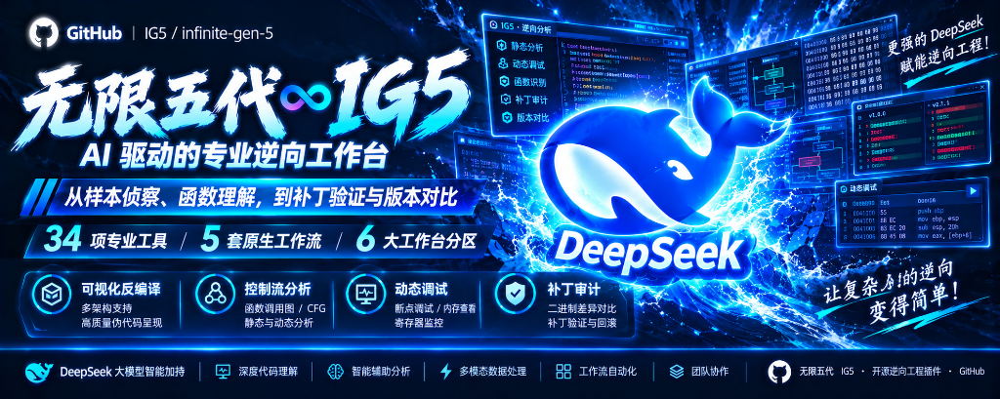

# ⚒️ DeepSeek Harness AI 驱动专业逆向工作台（无限五代 ∞ IG5）v0.9.0
（本工具仅限用于合法授权的软件逆向工程、安全审计与学术研究）

<p align="center">
  
</p>

<p align="center">
  <a href="dsh://plugin/install?id=dsh-infinite-gen-5&name=%E6%97%A0%E9%99%90%E4%BA%94%E4%BB%A3&version=0.9.0&repo=Minglink%2Fdsh-infinite-gen-5&permissions=%E5%AD%90%E8%BF%9B%E7%A8%8B(python%20worker)%2C%20%E6%96%87%E4%BB%B6%E5%86%99(artifacts)%2C%20%E4%BC%9A%E8%AF%9D%E6%8A%95%E5%BD%B1%2C%20%E5%AE%A2%E6%88%B7%E7%AB%AF%E4%BE%A7%E6%A0%8F%20tab&downloadUrl=https%3A%2F%2Fgithub.com%2FMinglink%2Fdsh-infinite-gen-5%2Farchive%2Frefs%2Fheads%2Fmaster.zip">
    
  </a>
  <a href="LICENSE">
    
  </a>
  
</p>

> 🌐 **插件生态市场**：[DeepSeek Harness Hub - DeepSeek 官方与开源生态市场 | 插件发现与一键安装](https://deepseek.stream/)

> ## 💬 DeepSeek 交流群 & 社区
>
> ### 👉 **红队安全交流 9 群：`338431075`**
> ### 👉 **腾讯频道技术交流社区：`pd86424753`**
>
> 🔥 欢迎进群交流 AI 辅助逆向工程心得、二进制安全审计经验、软件漏洞分析基准与大模型逆向工具生态共建！

---

## 🚀 项目定位与五代革命性升级

**无限五代（dsh-infinite-gen-5 / IG5）** 是专为 **DeepSeek Harness (DSH)** 桌面客户端打造的高性能、无头**纯逆向分析插件与可视化工作台系统**。

与上一代以提示词注入为主的形态不同，五代彻底实现了从“脚本封装”向**“专业级全功能 Agent 逆向工作站”**的本质蜕变：
* **零提示词常驻占领**：不侵占全局系统提示词，彻底杜绝大模型在日常对话中的偏见与输出畸变；
* **34 项专业逆向工具面**：覆盖从二进制快速侦察、CFG 拓扑、符号与结构体、微代码优化，到 Unicorn 内存仿真、动态调试与差异比对；
* **双模式动态降噪**：默认仅加载 **Core 8 核心工具**，保障常驻低 Token 消耗；高级场景一秒平滑展开为 **Full 34 全景工具**；
* **人机协作安全审批门**：写操作（打补丁、重命名、写回数据库）强制弹窗由人工确认，自建 `_op_journal` 支持确定性安全回滚；
* **现代化交互式工作台**：原生注入 DSH 桌面端，包含富交互 SVG CFG（平移/缩放/双击汇编跳转）、局部变量切片高亮、在线 C 结构体声明草稿箱与真实审计时间线。

---

> ### ⚖️ 严正法律免责与合规使用声明（Strict Legal & Compliance Disclaimer）
>
> **【合规与合法使用严正申明】**：本项目坚决反对并严禁任何形式的违法犯罪行为！本项目开发者绝不支持、不鼓励、不协助任何未授权漏洞挖掘、黑灰产破解、非法获取计算机信息系统数据或破坏计算机信息系统的活动。
>
> 1. **合法受控范围限定**：本项目定位为面向安全研究员、逆向工程师、高校师生及企事业单位的**辅助逆向工程科研工具与防御性软件安全审计套件**。使用本工具必须严格遵守《中华人民共和国网络安全法》、《中华人民共和国数据安全法》、《中华人民共和国计算机软件保护条例》及相关司法解释。**严禁在未经软件著作权人或资产所有者合法书面授权的目标、商业软件或生产系统上运行本项目**。一切逆向与调试行为必须严格限制在自有软件、授权网络安全演练靶标、开源软件审计及合规教学科研环境中进行。
> 2. **严禁违法恶意用途**：使用者严禁利用本项目直接或间接从事：
>    - 破解侵犯正版软件版权、绕过数字版权管理（DRM）或商业授权验证机制；
>    - 分析、提取或利用漏洞编写武器化恶意载荷、病毒木马或勒索软件；
>    - 逆向分析特定受保护的关键信息基础设施系统并实施未授权入侵或窃密；
>    - 违反相关大模型提供商的《服务条款（Terms of Service）》与《滥用政策（Usage Policy）》。
> 3. **开源协议与严格非商用限制（CC BY-NC-SA 4.0）**：本项目依据 **CC BY-NC-SA 4.0（署名-非商业性使用-相同方式共享 4.0 国际开源协议）** 及严禁商用特别条款“按现状（AS-IS）”提供。**严禁任何个人、企业或第三方将本项目（或二次开发衍生版本）用于商业售卖、付费倒卖、商业培训封装或黑灰产牟利，二次开发商用属于严重违法违规行为**。使用者应对自身的所有下载、部署、运行、修改、传播行为以及由此产生的全部输入与输出后果承担独立、完全的法律责任。项目作者与贡献团队绝不承担任何因使用者滥用导致的直接、间接或连带责任。
> 4. **第三方独立性声明**：本项目属于完全独立的开源逆向辅助工具研究项目，与 DeepSeek 官方或其关联主体无任何隶属、商业合作或官方背书关系。

---

## 🧰 工具面与能力矩阵（21 只读 + 11 审批 + 2 配置）

五代提供完整的 34 项逆向工具，并采用 **Core / Full 智能分级机制**：

| 类别 | 数量 | 工具清单 | 典型功能说明 |
| :--- | :---: | :--- | :--- |
| **只读分析面** | 21 | `ig5_doctor`, `ig5_open`, `ig5_status`, `ig5_funcs`, `ig5_strings`, `ig5_decompile`, `ig5_xrefs`, `ig5_calls`, `ig5_bytes`, `ig5_search`, `ig5_listing`, `ig5_scan`, `ig5_export_diff`, `ig5_cfg`, `ig5_slice`, `ig5_fingerprint`, `ig5_stack`, `ig5_switches`, `ig5_vtables`, `ig5_microcode`, `ig5_bindiff` | 覆盖段熵扫描、反编译、交叉引用、控制流拓扑、局部变量切片、虚表RTTI解析、微代码IR提取、跳转表恢复与多特征语义差异比对 |
| **写操作审批门** | 11 | `ig5_rename`, `ig5_patch_bytes`, `ig5_comment`, `ig5_analyze`, `ig5_set_type`, `ig5_undo`, `ig5_run_idapython`, `ig5_dbg`, `ig5_struct`, `ig5_switch_repair`, `ig5_emulate` | 所有操作在宿主执行前弹出人工审批确认框，操作执行后登记入审计日志；包含 NOP/字节补丁、C 结构体应用、内存仿真与调试交互 |
| **生命周期/配置** | 2 | `ig5_close`, `ig5_profile` | 会话安全关闭与工具集热切换（Core 8 ↔ Full 34） |

### 💡 Core 8 与 Full 34 动态降噪架构
* **Core 8 默认模式**：日常对话中仅注册 `ig5_doctor`、`ig5_open`、`ig5_status`、`ig5_funcs`、`ig5_strings`、`ig5_decompile`、`ig5_close`、`ig5_profile` 8 个工具，保证模型回复极速且免受 Token 膨胀干扰。
* **Full 34 展开模式**：遇到深水区分析时，模型可自动调用 `ig5_profile toolset=full`，或由用户在聊天框直接输入命令切换：
  ```text
  /ig5 toolset full   # 展开为全量 34 个专业工具
  /ig5 toolset core   # 恢复为轻量 8 工具省 Token 模式
  ```

---

## 🌟 核心高阶技术亮点

### 1. 交互式 SVG 控制流图 (CFG) 与变量切片
* **富交互画布**：工作台内置高性能原生 SVG 渲染引擎，支持鼠标平移（Pan）、滚轮缩放（Zoom），清晰标明分支与回边。
* **双击汇编跳转**：在流程图上双击任意基本块，即可直接呼出该块的只读反汇编指令检视窗。
* **局部变量数据流切片**：在符号列表中点击变量名，左侧反编译 C 代码会自动精准高亮该变量被读取与赋值的所有代码行。

### 2. 轻量纯内存单函数仿真执行 (`ig5_emulate`)
* **内置 Unicorn 2.1.4 引擎**：无需安装庞大的外部依赖，零环境污染。
* **纯内存隔离执行**：可针对特定解密算法函数（如字符串解密、Key 计算）喂入指定寄存器与内存参数，设定最大指令执行预算，秒级捕获解密后的内存数据与返回值，杜绝全速运行恶意程序的安全风险。

### 3. 原生 Win32 / 仿真动态调试车道 (`ig5_dbg`)
* 打通真实运行态全流程：支持进程启动（`start`）、ASLR 入口重定位断点、64 位寄存器读取与修改、单步步过（`stepover`）及内存读写。
* 包含完善的异常处理机制，能够结构化捕获内存访问违规（`0xc0000005`）等关键调试事件。

### 4. C++ 虚函数表 (vtables) 与跳转表 (Switches) 恢复
* 自动解析 MSVC 64 及 Itanium class/SI/VMI 真实继承链与 RTTI 字节布局，解决面向对象间接调用难题。
* 提取 `switch_info_t` 结构，精确恢复优化后跳转表的所有分支目标地址。

---

## ⚡ 一键安装方式

### 方式 1：dsh:// 协议联动一键安装（⚡ 桌面客户端最快，秒级免命令行）

若已安装 DeepSeek Harness 官方桌面客户端（EXE），点击下方按钮即可通过系统级 URI Scheme 协议安全唤起客户端完成免命令行秒级装载：

> 🌐 **插件生态市场**：[DeepSeek Harness Hub - DeepSeek 官方与开源生态市场 | 插件发现与一键安装](https://deepseek.stream/)

<p align="center">
  <a href="dsh://plugin/install?id=dsh-infinite-gen-5&name=%E6%97%A0%E9%99%90%E4%BA%94%E4%BB%A3&version=0.9.0&repo=Minglink%2Fdsh-infinite-gen-5&permissions=%E5%AD%90%E8%BF%9B%E7%A8%8B(python%20worker)%2C%20%E6%96%87%E4%BB%B6%E5%86%99(artifacts)%2C%20%E4%BC%9A%E8%AF%9D%E6%8A%95%E5%BD%B1%2C%20%E5%AE%A2%E6%88%B7%E7%AB%AF%E4%BE%A7%E6%A0%8F%20tab&downloadUrl=https%3A%2F%2Fgithub.com%2FMinglink%2Fdsh-infinite-gen-5%2Farchive%2Frefs%2Fheads%2Fmaster.zip">
    
  </a>
</p>

🔗 **原生协议链接：**

```
dsh://plugin/install?id=dsh-infinite-gen-5&name=%E6%97%A0%E9%99%90%E4%BA%94%E4%BB%A3&version=0.9.0&repo=Minglink%2Fdsh-infinite-gen-5&permissions=%E5%AD%90%E8%BF%9B%E7%A8%8B(python%20worker)%2C%20%E6%96%87%E4%BB%B6%E5%86%99(artifacts)%2C%20%E4%BC%9A%E8%AF%9D%E6%8A%95%E5%BD%B1%2C%20%E5%AE%A2%E6%88%B7%E7%AB%AF%E4%BE%A7%E6%A0%8F%20tab&downloadUrl=https%3A%2F%2Fgithub.com%2FMinglink%2Fdsh-infinite-gen-5%2Farchive%2Frefs%2Fheads%2Fmaster.zip
```

**网页端（前端）触发代码示例：**

```js
/**
 * 唤起 DeepSeek Harness 桌面客户端一键安装无限五代插件
 */
export function installInfiniteGen5ToDesktop() {
  const params = new URLSearchParams({
    id: 'dsh-infinite-gen-5',
    name: '无限五代',
    version: '0.9.0',
    repo: 'Minglink/dsh-infinite-gen-5',
    permissions: '子进程(python worker), 文件写(artifacts), 会话投影, 客户端侧栏 tab',
    downloadUrl: 'https://github.com/Minglink/dsh-infinite-gen-5/archive/refs/heads/master.zip',
  });

  const deepLink = `dsh://plugin/install?${params.toString()}`;

  // 通过隐藏 iframe 安全静默拉起协议
  const iframe = document.createElement('iframe');
  iframe.style.display = 'none';
  iframe.src = deepLink;
  document.body.appendChild(iframe);
  setTimeout(() => document.body.removeChild(iframe), 2000);
}
```

**协议参数配置表：**

| 参数名 | 值 / 示例 | 说明 |
| :--- | :--- | :--- |
| `id` | `dsh-infinite-gen-5` | 插件唯一标识符 |
| `name` | `无限五代` | 客户端展示名称 |
| `version` | `0.9.0` | 语义化版本号 |
| `repo` | `Minglink/dsh-infinite-gen-5` | 官方开源仓库地址 |
| `permissions` | `子进程(python worker), 文件写(artifacts), 会话投影, 客户端侧栏 tab` | 安全权限申请清单 |
| `downloadUrl` | `https://github.com/Minglink/dsh-infinite-gen-5/archive/refs/heads/master.zip` | 离线安装包直链 |

---

### 方式 2：Windows 本地自动化安装（推荐）

1. 克隆或下载本项目至本地；
2. 打开 PowerShell，进入本项目根目录；
3. 执行一键安装脚本：
   ```powershell
   .\install.ps1
   ```
4. 脚本将自动完成目录镜像、依赖注塑及 `cordis.patch.yml` 挂载；
5. 重启 DeepSeek Harness 客户端即可立即使用！

---

## 🧭 逆向工作台操作与常用指令

在对话框中可直接使用斜杠命令与模型工具调用：

### 1. 快捷斜杠命令（免模型 Token 消耗）
* `/ig5 status`：查看工作台引擎连接状态、会话数与内存池使用率；
* `/ig5 open <样本路径>`：快速启动目标二进制的后台自动分片分析；
* `/ig5 toolset full`：一秒展开为 34 个全量逆向分析工具面；
* `/ig5 toolset core`：恢复为 8 工具轻量模式；
* `/ig5 export`：快速导出本次分析会话的所有有效字节补丁与变更记录。

### 2. 5 大原生专家级工作流技能包（Runbooks）
系统预置了 5 套标准逆向分析流程，可在聊天中直接唤起：
* `/ig5-triage`：**新样本 10 分钟快速侦察流**（架构识别 → 熵与加密常量扫描 → 库函数过滤 → 提出关键假设）；
* `/ig5-deep-dive`：**核心算法攻坚流**（关键分支定位 → CFG 拓扑 → 变量切片 → 重建结构体与命名）；
* `/ig5-patch-and-sign`：**补丁实验与哈希签收流**（前置原字节安全校验 → 审批门提交 → 导出副本并校验 SHA-256）；
* `/ig5-diff`：**版本补丁差异比对流**（提取新旧二进制调用图与拓扑结构，定位 Patch 变更块）；
* `/ig5-debug-live`：**动态调试验证流**（断点设置 → 进程挂载 → 命中事件 → 寄存器回读）。

---

## 📁 项目目录结构

```
dsh-infinite-gen-5/
├── 🖼️ assets/
│   ├── banner.png               # 无限五代高分辨率宽屏海报
│   └── community.jpg            # 官方社区与交流群二维码
├── 🚀 一键安装与维护套件
│   ├── install.ps1              # Windows 自动化一键部署脚本
│   └── uninstall.ps1            # 自动化卸载脚本
├── 🧩 核心插件装载面 (Cordis 架构)
│   ├── package.json             # 插件元数据（dsh-infinite-gen-5 v0.9.0）
│   ├── index.js                 # 宿主核心（34工具注册 + 审批门 + 三大 HTTP 诊断端点）
│   ├── client.js                # 工作台前端（SVG CFG + 变量切片 + 结构体草稿箱）
│   ├── advanced_tools.js        # 高阶工具扩展（栈帧 / 跳转表 / 虚表 / 微代码 / 差异比对）
│   ├── semantic_diff.js         # 语义比对启发式匹配算法
│   ├── workflow.js              # 原生命令与技能包生命周期管理器
│   ├── cordis.patch.yml         # 宿主加载补丁配置
│   └── HARNESS_PLUGIN.md        # 插件技术规范文档
├── 🧠 原生逆向技能包 (skills/)
│   ├── ig5-triage/SKILL.md      # 新样本快速首探 Runbook
│   ├── ig5-deep-dive/SKILL.md   # 单函数深挖 Runbook
│   ├── ig5-patch-and-sign/      # 补丁验证与导出 Runbook
│   ├── ig5-diff/SKILL.md        # 版本差异比对 Runbook
│   └── ig5-debug-live/SKILL.md  # 动态调试交互 Runbook
├── 🐍 后端逆向工作进程 (worker/)
│   ├── ig5_worker.py            # JSON-RPC 核心通信进程（Reverse 引擎封装）
│   ├── advanced_analysis.py     # C++ 虚表/RTTI/微代码/跳转表分析实现
│   ├── execution_analysis.py    # Unicorn 仿真执行核心
│   └── vendor/unicorn/          # 插件内置 Vendored Unicorn 2.1.4 运行时
└── 🧪 自动化测试套件 (scripts/)
    ├── test_new_tools.mjs       # 真实样本基础工具烟测
    ├── test_advanced_runtime.mjs# Unicorn 仿真 / 微代码 / 虚表 / 跳转表回归测试
    ├── test_debug_runtime.mjs   # 原生 Win32 真实进程调试全流程闭环回归
    ├── test_client.mjs          # SVG CFG / 变量切片 / 竞态条件前端自动化测试 (14/14 通过)
    ├── test_workflow.mjs        # Core8/Full34 切换与命令生命周期测试
    └── test_patch_runtime.mjs   # 补丁审批与安全回滚测试
```

---

## 💬 官方交流社区

> 📌 **非盈利开源公益项目，严禁任何主体用于商业售卖、付费倒卖或黑灰产牟利，仅供技术研究交流。**

<p align="center">
  <br>
  <sub><b>🌐 官方技术交流社区（腾讯频道号：pd86424753 · 红队安全交流 9 群：338431075）</b></sub>
</p>

---

## 📄 开源协议与非商用特别声明（License）

本项目采用 **[CC BY-NC-SA 4.0（署名-非商业性使用-相同方式共享 4.0 国际许可协议）](LICENSE)** 进行开源，并附加以下严格的法律与商业限制条款：

1. 🚫 **严禁直接商业使用**：禁止任何个人、企业或第三方将本项目（包括源码、二进制组件、前端界面、分发包及文档）用于商业售卖、付费倒卖、付费社群、会员增值服务或黑灰产牟利。
2. 🚫 **严禁二次开发商业化**：任何基于本项目的 Fork、修改、重构、二次开发或作为组件嵌入其他软件时，**必须严格继承 CC BY-NC-SA 4.0 协议并完全开源，绝对禁止将任何二次开发或衍生作品用于商业营利**。二开商用属于严重侵权及违法违规行为。
3. ⚖️ **违规终止与法律追责**：任何违反非商业性条款或将本项目用于违法黑产活动的行为将导致开源授权自动且永久终止，原作者保留依法追究侵权方民事赔偿与法律责任的一切权利。
