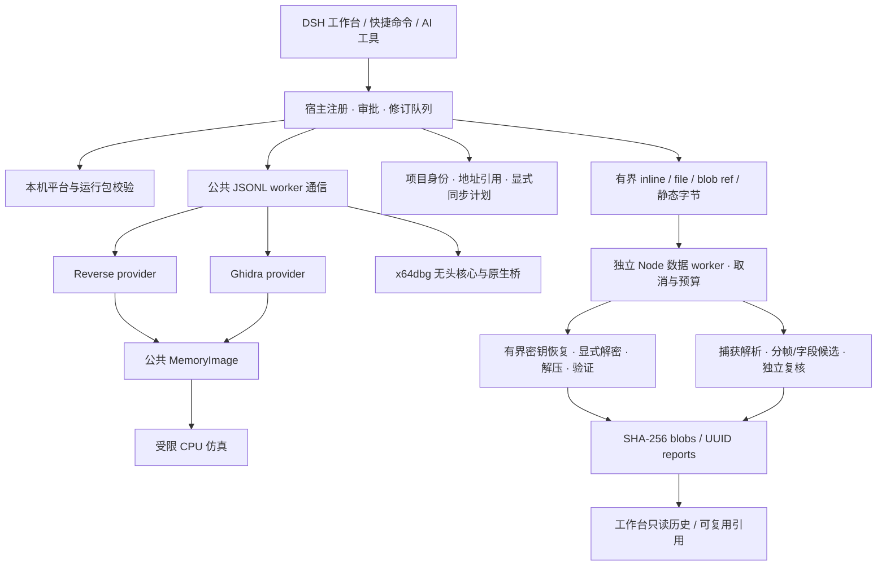

# IG5 1.0.0 重构结构

桌面端保留完整工具面，Core 8 / Full 38 与 12 个工具名称的审批门继续生效。重构围绕执行协议、数据库身份、可移植 CPU 核心和独立数据分析层，不以合并原生数据库作为统一的前提。新增解密/协议工具只处理提供的数据与显式参数，不执行样本或修改原始输入/引擎数据库。

| 模块 | 职责 | 必须保留的约束 |
| --- | --- | --- |
| `index.js` | 工具注册、只读路由、审批、会话队列 | 写入修订守卫、取消分类、缓存失效 |
| `source/worker_transport.js` | 子进程启动、JSONL 分帧、ready / doctor、RPC、超时与退出 | UTF-8 字节预算、启动队列预算、早退出、精确取消、单次完成 |
| `workflow.js` | Core/Full、技能和命令的注册与清理 | 支持 scoped API 时全局 Core8、当前 agent 展开 Full38；旧宿主明确 instance 作用域 |
| `source/host_platform.js` / `engine_runtime.js` | 执行设备身份、平台与原生依赖校验 | 手机浏览器不会改变 worker 的实际平台；不回落到不兼容的 Windows 包 |
| `source/project_store.js` / `attachment_lease.js` / `address_ref.js` | artifact、attachment、进程所有者、数据库与地址身份 | 宿主及 worker 创建身份与 nonce；物理数据库排他；地址空间不可混用 |
| `source/audit_history.js` / `patch_export.js` | 审计游标分页、补丁导出来源过滤 | 异步有界读取；当前 artifact/hash/engine 与映射核验；不重放旧样本补丁 |
| `analysis_tools.js` | 数据输入选择、静态读取、工具 schema 与历史结果 | inline / file / ref / source 四选一；静态队列和修订；不接受用户输出路径 |
| `source/analysis_jobs.js` / `analysis_worker.js` | 隔离纯数据分析与有限队列 | 超时、取消和内存预算；终止数据 worker 不影响引擎 worker |
| `source/analysis_artifacts.js` / `history_index.js` | 内容地址输入/输出、报告、异步索引及归档 | SHA-256 blobs、UUID report、目录身份核验；有界批次与缓存；归档保留报告和引用 |
| `source/crypto_analysis.js` / `crypto_recovery.js` | XOR/AES、解压、验证及有界密钥候选 | 1 MiB 输入/输出；认证前不发布明文；统计候选不当验证；不穷举随机 AES 全空间 |
| `source/protocol_analysis.js` / `protocol_inference.js` | 捕获、分帧、字段候选及独立 holdout | 8 MiB 输入；方向/缺口/冲突和预算；有限 framing 推断不当完整协议语义 |
| `adapters/ghidra` | Java 分析、结构化 raw / high p-code、内存提供器 | 保存状态和耐久修订分开；IR 输出有预算与截断标记 |
| `adapters/x64dbg` | NamedPipe 原生桥、调试执行与暂停上下文 | owner、runId、stopSeq 与审批；真机事件决定状态 |
| `worker/memory_image.py` | 引擎无关内存区域与有界读取 | 地址范围、重叠、映射预算、缺失字节必须明确 |
| `worker/cpu_emulator.py` | x86 / x64 / ARM64 CPU 执行 | 64 MiB；已知引擎页权限；指令与时间预算；无 OS、导入或 TLS 环境 |
| `client.js` | 桌面双栏、窄屏详情、SVG、审计和结构体草稿 | 只读 HTTP；写草稿交给宿主审批；旧请求不覆盖新选择 |

工作台在选择函数时先读取伪代码与调用关系，CFG 和变量焦点行在进入对应视图时读取。选择包含路径、引擎、会话与请求代次；同地址换函数、换样本或换引擎均不能复用旧响应。SVG 根据真实容器尺寸适配，支持平移、缩放、触控点按和双指缩放；移动端显示单个详情并提供返回列表。

数据分析报告与原生数据库生命周期分开。file/ref/inline 输入无需静态会话，静态 source 则明确 target/engine/ea/size，并优先提供 expected_revision。输入的来源和范围保存为证据；可选结果关联不证明算法属于该样本。数据 worker 只接收受限 bytes/recipe/schema，完整输出经 artifact 层保存，模型仅收到有截断标记的报告视图与 ref。后续阶段按 ref 加明确 `input.result_id` producer UUID 复用数据，宿主核验 ref 属于所选报告并保留来源；不带 ID 时标记 unbound，不以共享 hash 猜样本关联。这样可以避免把大报文、明文和秘密参数反复写入上下文，同时不混淆相同字节的不同证据。

原生 worker 的 JSONL 接收按 UTF-8 字节计量：单行最多 16 MiB，累计未解析缓冲最多 32 MiB；配置处理器前最多暂存 256 条/8 MiB 消息。超限单次拒绝 ready 和待办 RPC、释放缓冲并终止所属 worker，不终止其他会话。终止请求或断管不证明数据库已关闭，attachment 只在实际退出或确认 close 应答后释放。

attachment 保存宿主和 worker 的 PID、OS 创建身份以及 nonce。启动恢复必须确认两个原进程均已退出，并在元数据锁内重新核验同一 nonce 和完整所有者；任一存活、未知、旧格式或不同机器的租约保持占用。进程锁恢复与数据库租约恢复是两个不同步骤。

审计使用异步倒序扫描与 `nextCursor`：每页默认最多扫描 4 MiB，单行最多 2 MiB；游标绑定文件身份、快照范围和筛选，允许正常追加，检测同大小改写、替换或截断。它不是防篡改完整性链，不能检测所有“改写旧前缀并追加”情况。大历史的 `total` 可为空，必须保留 lower bound/partial，不能冒称完整计数。

补丁导出以当前 artifact/hash/engine、数据库身份和当前映射为准，Windows 路径大小写按同一目标处理；旧样本/数据库记录排除，目标路径存在无法绑定的 legacy 补丁记录时明确拒绝导出。最多 16,384 个不同审计范围、合计 8 MiB 字节、4 MiB changes report。二进制与报告都使用独占新建的暂存文件再 rename，输出目录拒绝链接并重验身份，避免覆盖旧报告 hardlink 所指的其他文件。两个输出分别提交；报告提交失败保留明确 partial 证据，不宣称跨文件原子性。

分析历史对 active/archived metadata 分别建异步索引，每批最多检查 10,000 个目录项、读取 16 MiB，每条 metadata 最多 8 KiB。后续请求继续未完成扫描，完整索引按目录代次缓存；最多索引 100,000 条，达到上限保持 partial。分页仅读取选中 metadata，缓存条目改写或目录替换拒绝。`ig5_profile history` 提供 stats/archive/restore；归档移动 metadata，保留结果 UUID、完整报告和 blobs，恢复后引用继续有效。归档减少活跃列表范围，不释放磁盘空间，也没有自动 blob GC。

单个完整报告最多 8 MiB，读取时核验 metadata 中提交的 record SHA-256。report 与 metadata 分别提交，metadata 缺失明确不可读，不宣称跨文件原子性。分析目录按保存的 dev/ino 和非链接属性校验，文件读取核对打开前后身份与大小/时间。

解密/协议闭环由七个 runbook 的相应技能编排：静态定位 → 显式参数或已授权动态捕获 → 数据变换/解码 → 已知明文或多报文对账 → 产物引用。数据操作不修改 IDB；函数执行仍由 ig5_emulate/ig5_dbg 审批，名称/类型/注释回写仍由原有工具审批。工作台仅读取已有报告并生成 composer 草稿，不通过 GET 创建执行任务。详细接口与验收见 [CRYPTO_PROTOCOL](CRYPTO_PROTOCOL.md)。

## 能力边界

自动恢复仍使用独立数据 worker：`crypto_recovery.js` 做预算内 XOR 密钥假设和 AES 候选材料验证，`protocol_inference.js` 做分帧/字段关系候选与 holdout 复核。结果保持统计候选、约束、认证和独立验证的区别；AES 不做随机全空间穷举，协议不自动赋予字段语义或重建通用状态机。完整恢复密钥只以 sensitive blob ref 保存，`recipe.key_ref` 同时核验 producer、完整 mask、样本/引擎/attachment 和修订；不经模型展开秘密。工作台 recover/infer 草稿不自动发送。参数、预算及复用见 [AUTODISCOVERY](AUTODISCOVERY.md)。

- `ig5_slice` 是变量表与标识符焦点行，不是完备数据流或污点分析。
- Ghidra raw p-code 是指令级 IR，high p-code 包含恢复变量与 SSA varnode 信息；它们不等同于 Reverse 微码成熟度。
- 版本差异匹配仍为多特征启发式，不声称证明两个函数语义等价。
- 仿真在复制的内存中执行，不能替代 Windows / Android / iOS 真实系统调用。
- 遇到 syscall / sysenter / CPU interrupt 明确中止，停止原因区分超时、指令上限、HLT、未映射与页保护 fault。已知引擎 R/W/X 权限以 4096-byte 页传给 Unicorn；同页的不同区间使用权限并集，不能表达字节级保护。未知权限才使用兼容 RWX 并报告 unknownPermissionRegions/Pages；合成栈和新建缓冲页为 RW，注入缓冲不提升已有引擎页权限。这不是操作系统页保护或进程环境的完整模拟。
- 虚表、RTTI、跳转表输出依赖已有证据与具体 ABI；未知间接调用不会自动生成确定目标。
- 图形、调试、同步各自返回真实的预算、暂停身份或提交状态，不能由 UI 推断成功。
- 熵、压缩头、API 与常量只支持候选判断；CBC padding 成功不证明 key/明文正确。GCM 认证与明确 expected 对比分别报告，缺少 expected 保留 not-requested。
- TCP 只重建观察到的字节；缺口分成连续片段，冲突保留第一捕获值作为明确假设并禁自动解码。不假造握手前的帧起点，不实现 IP 分片重组、IP/TCP/UDP checksum 验证、实时抓包或协议状态机自动推导。消息尾部 xor8/sum8/CRC32 关系候选与独立 holdout 另行报告，不等同于捕获传输层校验。
- Node 数据层无需商业或开源静态引擎，有合适 Node/worker_threads 宿主即可复用；当前尚未完成 Android/iOS 真机验证或手机原生引擎包，浏览器 UI 兼容不等于离线执行移植。

Unicorn 的 Python 绑定实际加载 `unicorn.dll`；本轮只移除未使用的 49,894,000 字节静态链接档案 `unicorn.lib`。原始 wheel RECORD、移除文件 hash 与许可证保留，所有执行测试仍使用相同原生 DLL。这不改变 Git 历史体积，也不构成 ARM64 宿主二进制移植。

Ghidra 的本地工程路径另有最小源码兼容补丁，允许默认 `.dsh` 目录；项目名、仓库及域内路径仍用原严格校验，点路径穿越保持拒绝。补丁只替换 Project.jar 中的 GhidraURL.class 及对应源码 ZIP entry；固定上游源码不改，Apache 通知、原／新 hash 和可重复构建脚本单独保留。默认工程路径的原生 URL 边界、关闭后进程重开及反编译持久化均有独立真实回归。
