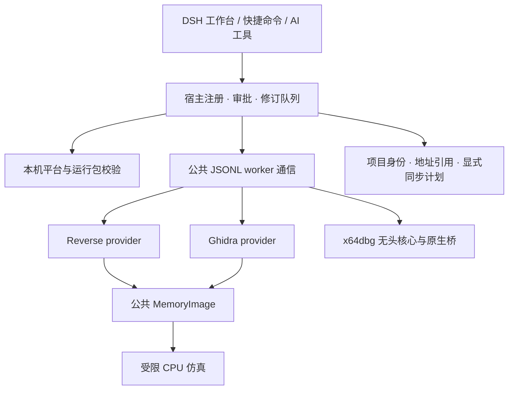

# IG5 1.0.0 重构结构

桌面端保留完整工具面，Core 8 / Full 36 与 12 个工具名称的审批门继续生效。重构围绕执行协议、数据库身份和可移植分析核心，不以合并原生数据库作为统一的前提。

| 模块 | 职责 | 必须保留的约束 |
| --- | --- | --- |
| `index.js` | 工具注册、只读路由、审批、会话队列 | 写入修订守卫、取消分类、缓存失效 |
| `source/worker_transport.js` | 子进程启动、JSONL 分帧、ready / doctor、RPC、超时与退出 | UTF-8 分块、早退出、精确取消、单次完成 |
| `source/host_platform.js` / `engine_runtime.js` | 执行设备身份、平台与原生依赖校验 | 手机浏览器不会改变 worker 的实际平台；不回落到不兼容的 Windows 包 |
| `source/project_store.js` / `address_ref.js` | artifact、attachment、数据库与地址身份 | 物理数据库排他锁；VA / RVA / file / runtime 地址不可混用 |
| `adapters/ghidra` | Java 分析、结构化 raw / high p-code、内存提供器 | 保存状态和耐久修订分开；IR 输出有预算与截断标记 |
| `adapters/x64dbg` | NamedPipe 原生桥、调试执行与暂停上下文 | owner、runId、stopSeq 与审批；真机事件决定状态 |
| `worker/memory_image.py` | 引擎无关内存区域与有界读取 | 地址范围、重叠、映射预算、缺失字节必须明确 |
| `worker/cpu_emulator.py` | x86 / x64 / ARM64 CPU 执行 | 64 MiB；指令与时间预算；无 OS、导入或 TLS 环境 |
| `client.js` | 桌面双栏、窄屏详情、SVG、审计和结构体草稿 | 只读 HTTP；写草稿交给宿主审批；旧请求不覆盖新选择 |

工作台在选择函数时先读取伪代码与调用关系，CFG 和变量焦点行在进入对应视图时读取。选择包含路径、引擎、会话与请求代次；同地址换函数、换样本或换引擎均不能复用旧响应。SVG 根据真实容器尺寸适配，支持平移、缩放、触控点按和双指缩放；移动端显示单个详情并提供返回列表。

## 能力边界

- `ig5_slice` 是变量表与标识符焦点行，不是完备数据流或污点分析。
- Ghidra raw p-code 是指令级 IR，high p-code 包含恢复变量与 SSA varnode 信息；它们不等同于 Reverse 微码成熟度。
- 版本差异匹配仍为多特征启发式，不声称证明两个函数语义等价。
- 仿真在复制的内存中执行，不能替代 Windows / Android / iOS 真实系统调用。
- 遇到 syscall / sysenter / CPU interrupt 会明确中止，不把无 OS 的返回值当作系统调用成功；停止原因区分真实超时、指令上限与 HLT。当前映射页统一可读写执行，不用于检验真实内存页保护。
- 虚表、RTTI、跳转表输出依赖已有证据与具体 ABI；未知间接调用不会自动生成确定目标。
- 图形、调试、同步各自返回真实的预算、暂停身份或提交状态，不能由 UI 推断成功。

Unicorn 的 Python 绑定实际加载 `unicorn.dll`；本轮只移除未使用的 49,894,000 字节静态链接档案 `unicorn.lib`。原始 wheel RECORD、移除文件 hash 与许可证保留，所有执行测试仍使用相同原生 DLL。这不改变 Git 历史体积，也不构成 ARM64 宿主二进制移植。
