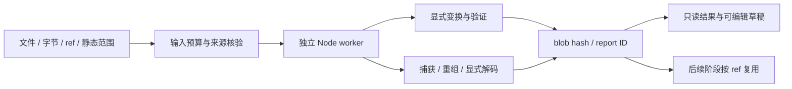

# 解密、配置提取与协议证据工作流

IG5 1.0.0 增加 `ig5_crypto` 与 `ig5_protocol`，Full 工具面从 36 扩展为 38，Core 8 和原有 12 项审批范围保持。新增 `ig5-crypto`、`ig5-protocol` 两个 runbook，连同既有五个共七个。它们把引擎定位、字节捕获、数据分析和验证接成可复用流程；数据变换与原生数据库、样本执行分开维护。

这两项工具处理离线数据，支持显式 XOR/AES 解密、解压、捕获解析与字段解码，并扩展有界 XOR 密钥恢复、AES 候选材料检索和未知 framing/字段推断。候选、认证与独立验证分别保留；不提供随机 AES 全空间破解、通用解密函数恢复、完整协议语义/状态机自动恢复、实时抓包或主动发包。新增参数与复用流程见 [自动恢复与推断](AUTODISCOVERY.md)。静态扫描的熵、常量和 API 只是证据，手机原生运行包仍未完成。

## 输入与结果复用

先通过 `ig5_profile toolset=full` 或 `/ig5 toolset full` 启用高级工具。支持 scoped API 的 DSH 只扩展当前 agent，旧宿主明确返回插件实例作用域；两种切换都不改变运行和写审批。每次分析的 `input` 必须选择一种来源：

| 来源 | 参数形态 | 范围与身份 |
| --- | --- | --- |
| 内联字节 | `{"encoding":"hex","data":"010203"}` 或标准 padded base64 | 拒绝奇数 hex、分隔符、非 canonical base64；先检查长度再解码 |
| 本地文件 | `{"path":"C:\\samples\\capture.pcap"}` | 明确只读普通文件；拒绝特殊/链接文件、超预算及读取期间的替换/修改 |
| 分析 blob | `{"ref":"sha256:<64位小写hash>","result_id":"<产生该ref的报告UUID>"}` | 核验实际字节 hash，并明确选择 producer report 保留来源；不能仅凭共享 hash 推断样本归属 |
| 静态字节 | `{"source":{"target":"C:\\samples\\app.exe","engine":"ghidra","ea":"0x140003000","size":256,"expected_revision":3}}` | 要求实际打开的静态会话；按队列读取完整映射范围并检查修订，EA 不可替换为运行时 VA |

静态示例地址与修订必须替换为当前实际证据。没有静态会话时，inline/file/ref 仍可独立工作；可选 `target` 只是报告关联，不确认算法归属。动态内存需从已授权且经过审批的 `ig5_dbg` 暂停或 `ig5_emulate` 返回捕获，保留 runId/stopSeq、模块映射、地址及长度。

报告返回独立 `result_id`、输入来源、SHA-256 ref、输出摘要与有限模型视图。完整输入/输出 blobs 和 JSON 报告放在 `artifactDir/analysis-data`，不修改源文件和引擎数据库，不接受任意输出路径。后续阶段传入前次 `output.ref` 或协议片段的 `dataRef.ref`：取前一步顶层 `result_id`（或对应输出引用上的 `result_id`），在下一步 `input.result_id` 提交该 producer UUID。宿主核验 ref 确实属于所选报告，保留 derivedFrom 和样本关联。不给 producer ID 时明确标记 unbound，不用共享 hash 猜测来源；显式 target/engine 与已绑定来源冲突时拒绝。用 `action=result result_id=...` 重读报告；可通过 `select` 选择短 dot path，例如 `verification` 或 `flows.0.directions.0.chunks`。模型响应超预算有明确截断；更小的 select 可以读取对应部分，不能假定一条响应包含全部 packet/frame。

历史列表对 active/archived metadata 分别建立异步索引，不读取全部完整报告。每批最多检查 10,000 个目录项、读取 16 MiB；单条 metadata 最多 8 KiB，未完成时返回 partial/indexing 与 lower bound，后续读取继续扫描，完整索引缓存最多 100,000 条。分页只读取选中 metadata，并检查缓存摘要与文件身份。`ig5_profile history={action:stats|archive|restore,ids:[...]}` 管理历史；stats 不需要 ids，archive/restore 要求 1–1000 个不同结果 UUID。归档仅移动 metadata，保留 result_id、报告与 blob/key refs；不是删除或磁盘回收。移动部分失败返回 ids/remaining 与 atomic=false。

完整 report 最多 8 MiB，读取时核验已提交 metadata 中的 record SHA-256。根目录及 blobs/records/metadata/archived-metadata 子目录核对非链接属性和 dev/ino 身份，替换目录或选中缓存 metadata 改写明确拒绝。report 与 metadata 是两次文件提交；metadata 缺失时报告不可读，不宣称跨文件原子提交。工作台审计另外使用异步字节游标，不能把未知总数显示为完整历史计数。

分析 blob 的 ref 与 native 项目的 artifactId、attachmentId、dbRevision 不同。显式解密 key、IV、tag 和 AAD 不写入报告；恢复得到的 key 进入单独 sensitive blob，报告只给 hash/ref/长度，完整 key 可通过 producer 绑定的 recipe.key_ref 复用。原始参数证据仍由用户保管。该预览限制不是本地访问权限隔离：unbound ref 和用户直接读取本地文件保留既有能力。输入、明文及密钥产物属于用户数据，不随插件发行。报告是对明确输入/参数的证据，不是全样本结论。

## 解密与配置提取

`ig5_crypto` 的 `action` 是 `inspect`、`recover`、`transform`、`verify` 或 `result`。`recover` 的预算、候选来源、敏感 key ref 和验证规则见 [AUTODISCOVERY](AUTODISCOVERY.md)。

| 操作 | 已实现行为 | 必须检查 |
| --- | --- | --- |
| inspect | 范围、SHA-256、字节统计、熵、UTF-8 与 hex/base64 文本/压缩头证据 | 小样本熵不可靠；头部不是有效载荷证明；没有自动算法判断 |
| transform / xor | 仅按提供的非空 key 重复 XOR | 文本可读或 magic 相同不等于已验证；模块另支持明确 recipe.key_offset |
| transform / aes-cbc | 16/24/32-byte key，16-byte IV，显式 none/pkcs7 | 密文完整块；PKCS7 检查失败不返回输出；padding 成功没有消息认证 |
| transform / aes-ctr | 16/24/32-byte key，16-byte 初始 counter block，padding=none | counter/参数来自实际证据；可处理尾部非整块 |
| transform / aes-gcm | 显式 key、非空 IV、tag、可选 AAD，padding=none | `final()` 认证完成后才返回明文；错误 tag/AAD 不发布任何明文 |
| transform / gzip 或 zlib | 有输出预算的解压与格式/checksum 检查 | 压缩炸弹、损坏、尾随数据拒绝；选择准确的 offset/length |
| verify | 与明确 expected 字节做长度和精确比较 | matched/mismatched/not-requested 分开；首个差异相对所选范围/输出 |

输入/输出上限各 1 MiB；默认预览 256 字节、最多 4096 字节。hex 预览始终可用，UTF-8 预览明确 valid 标志并以 JSON 字符串显示控制字符。`offset`/`length` 以本次输入起点为基准；不能暗中把整个样本的文件偏移套到 blob 起点。

以下是公开的 XOR 数据测试，expected 来自明确字节，不声称源自某个实际二进制：

```json
{
  "action": "transform",
  "input": {"encoding": "hex", "data": "000102"},
  "recipe": {"kind": "xor", "key": {"encoding": "hex", "data": "01"}},
  "expected": {"encoding": "hex", "data": "010003"},
  "preview_limit": 32
}
```

对应 `ig5_crypto` 返回 verification=matched，并提供三字节输出的 ref。实际配置提取可按以下流程：

1. 从字符串、导入、`ig5_scan`、xref 和调用/反编译定位处理函数，列出 key/IV/长度来源与候选顺序。
2. 只读恢复明确参数；若需要执行，先使用已有审批流程捕获输入和输出，不用数据工具绕过执行审批。
3. 用明确 AES 参数变换，检查 GCM authentication；将前次 `output.ref` 和对应 `result_id` 传给 gzip/zlib 阶段。
4. 有确定明文时提供 expected；无 expected 则记录 not-requested，不以成功返回或可读 JSON 宣称已验证。
5. 用独立向量或多条配置复核，并保留处理路径、范围、参数来源、result_id、refs 与验证状态。

固定 AES 向量测试采用 [NIST SP 800-38A](https://nvlpubs.nist.gov/nistpubs/legacy/sp/nistspecialpublication800-38a.pdf) 的 CBC/CTR；GCM 测试覆盖固定向量、错误 tag、AAD 与零长度明文。它们验证 IG5 的数据操作，不构成 NIST 认证，也不证明任意样本采用 AES。`scripts/test_crypto_analysis.mjs` 还验证预算、严格输入、padding、压缩尾随数据及 AES-GCM→gzip→明确配置的闭环。

## 捕获、分帧与字段解码

`ig5_protocol` 的 `action` 是 `inspect`、`capture`、`infer`、`decode` 或 `result`。`infer` 输出可直接 decode 的有证据候选，保留独立 holdout、歧义与起点限制，详见 [AUTODISCOVERY](AUTODISCOVERY.md)。

`inspect` 提供字节摘要、熵、有限 ASCII 字符串和与输入长度相符的前缀候选；不会自动识别完整协议。`capture` 读取已有 PCAP/PCAPNG，支持受支持的 Ethernet/VLAN、raw IPv4/IPv6 与 TCP/UDP，保留捕获位置、索引、方向和时间单位。支持范围外的 link type、IP 分片、扩展或 capture block 明确报告，不默默当成正常报文。

TCP 以方向和序号重建观察字节，比较重传，缺口分成连续 chunks；冲突记录不同观察并保留第一捕获值作为明确假设，禁自动解码。SYN/FIN、新连接 incarnation 与序号回绕是实际证据的一部分；缺少握手时不假定第一个 payload 是帧起点，缺口之后也不自动重置帧边界。UDP 保留每个 datagram。capture 分别报告 parseComplete、reassemblyComplete、decodingComplete；省略 packet 预览后 unsupportedSummary 仍保留原因计数。没有 IP 分片重组、网络 checksum 验证、操作系统执行或加密流自动解密。IPv6 仅有限扩展链（最多 8 层），ESP 与 jumbogram 明确不支持；PCAPNG 支持 EPB/SPB，经典 packet block 2 明确标记 unsupported。

`decode` 接受显式 framing/schema。固定长度 framing 给 length；length-prefix 给 offset、size（1/2/4）、endian、headerLength、lengthIncludesHeader 和必要 adjustment；delimiter 仅 LF/CRLF 且 includeDelimiter=true。varint-prefix 使用 canonical unsigned LEB128，明确 offset、maxBytes（1–5）、headerBytesAfterLength 和长度语义；tlv 给 typeSize（1/2）、lengthSize（1/2/4）、endian 与长度语义。TLV 不等于嵌套 TLV、BER/DER 或通用语义恢复。`infer` 可在预算内提出这些 framing 的有限候选，但仍需独立 holdout 和实际解析代码复核。

字段给 name、offset、type，支持 u8/u16/u32/u64、i8/i16/i32/i64、bytes、utf8、varint。数值端序应明确，bytes/utf8 给 length；64 位整数保留精度。字段 span 保留帧内与输入偏移，UTF-8 错误、varint 溢出/非 canonical、越界和尾部不完整帧明确标记。动态 varint 前缀后的 payload 不能由一个固定 offset 覆盖所有帧。协议顶层 offset/length 可选择 input/ref 的确切范围，宿主先完整有界读取再切片，不绕过输入上限。

以下两个报文使用“2-byte 大端 payload 长度 + 1-byte 类型 + 3-byte payload”，这是提供的 schema，不是工具自行推导的协议：

```json
{
  "action": "decode",
  "input": {"encoding": "hex", "data": "000401616263000402646566"},
  "framing": {"type": "length-prefix", "offset": 0, "size": 2, "endian": "big", "headerLength": 2, "lengthIncludesHeader": false, "adjustment": 0},
  "schema": {"name": "example-v1", "fields": [
    {"name": "payload_length", "offset": 0, "type": "u16", "endian": "big"},
    {"name": "message_type", "offset": 2, "type": "u8"},
    {"name": "payload", "offset": 3, "type": "bytes", "length": 3}
  ]}
}
```

将该 JSON 作为 `ig5_protocol` 参数可解出两帧。实际流程应先 `capture`，检查方向/holes/conflicts/truncated，再取正确的 `dataRef.ref` 做 decode；未知帧起点需要额外解析函数或动态证据，不能仅看到连续字节就强行对齐。至少用多条独立报文以及截断/错误长度样本复核；将字段值与真实解析函数分支或已授权暂停观察对账。状态机的推导仍需多阶段会话和函数状态迁移，不是这次工具自动生成的功能。

协议输入最多 8 MiB，默认最多 1000 packets、128 frames、2 MiB 重组字节；参数可在模块允许范围内调低或调高包/帧数，不能突破输入/重组/单帧等硬限制。各层同时保留 complete、truncated、issues、unsupported 或遗漏标记。`scripts/test_protocol_analysis.mjs` 验证构造捕获的多端序/时间分辨率、方向/乱序/重传/冲突、SYN/FIN/回绕、明确 schema/精确整数与多级预算；不将夹具覆盖外推为任意网络协议支持。

## 架构与界面



数据 worker 有限队列、超时与内存预算，取消或关闭不会杀原生引擎。宿主协调输入与 artifacts，纯模块不读任意路径或调用引擎；静态读取仍服从会话队列/修订，写入和执行仍经原有审批门。工作台只读已有历史结果，composer 插入用户可编辑草稿，不自动提交、不覆盖既有草稿、不借 GET 发起分析或调试。完整报告和有限模型视图分别处理，界面必须保留真实验证/完整性状态。

工作台候选视图最多呈现 8 行，字节引用预览最多 256 bytes；普通引用、恢复密钥、framing/schema 复用和 archive/restore 都生成可编辑草稿，由用户发送。密钥引用不自动展开。历史不完整时显示下限和索引状态，审计继续页使用 cursor，不用虚假的完整 total 掩盖扫描预算。

纯 Node 数据层不依赖 Reverse/Ghidra/x64dbg，可以在拥有 Node/worker_threads 的环境复用。当前交付并未完成 Android/iOS 真机验证、原生引擎移植或离线模型权重；手机浏览器布局通过不能当作手机独立离线执行通过。桌面仍是核心执行与验收环境。
